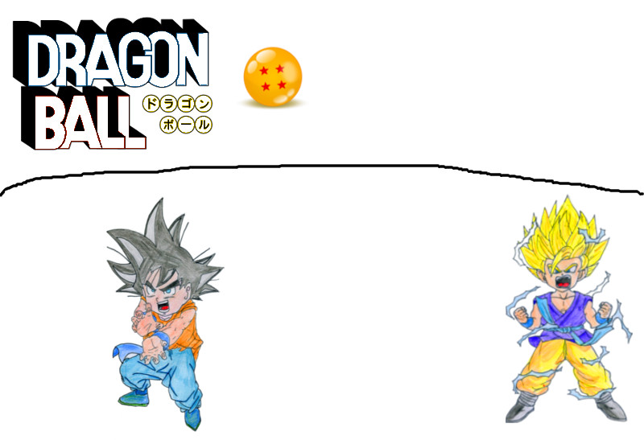
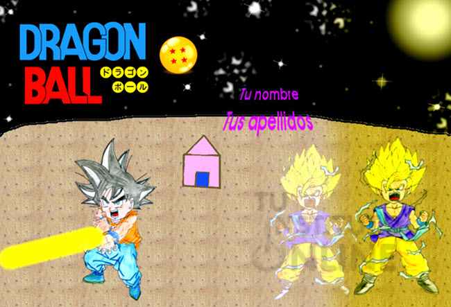

# Examen GIMP

## Duración

50 minutos.

## Fecha

Miércoles 24 de diciembre de 2020 a las 16:30.

# 0 Descarga de imagen

Descarga la imagen de Dragon Ball y ábrela en GIMP.

# 1 Cielo (2 puntos)

Utiliza los `pinceles` que quieras:

1. Pinta el cielo de color negro.
2. Dibuja las estrellas, reflejos y nebulosas según se desee.
3. Dibuja la luna con color blanco y resplandor en la esquina superior derecha de la imagen.

Utiliza algunos efectos para conseguir un resultado parecido al de la imagen final.

# 2 Suelo (1 punto)

1. Dibuja una casa pequeña con una puerta y rellena con los 2 colores que prefieras.
2. Utiliza la `herramienta de relleno` para pintar el suelo donde están los personajes con un patrón de relleno parecido al de la imagen final.

# 3 Degradado (1 punto)

Vamos a crear un contraste de luces con la `herramienta degradado`:

1. Crea un **degradado bilineal** tipo **Shadows** (vale **Shadows 1**, **Shadows 2** o **Shadows 3**) con **opacidad 25**.
2. Aplícalo sobre la superficie de la luna de izquierda a derecha.

# 4 Título (1 punto)

Utiliza la `herramienta texto` para:

1. Rellenar las letras del texto **`DRAGON`** en **azul**.
2. Rellenar las letras del texto **`BALL`** en **rojo**.
3. Rellenar el fondo de las bolas al lado del título con color **amarillo**.

# 5 Personaje de la derecha (1.5 puntos)

Utiliza la `herramienta de clonado` para:

1. Clonar el personaje de la derecha en la parte izquierda.
2. Utiliza el modo **Clarear sólo**.
2. Sitúa el personaje clonado como se ve en la imagen final.

# 6 Personaje de la izquierda (0.5 puntos)

1. Dibuja un rayo de luz amarilla en línea recta desde las manos hacia la parte izquierda.

# 7 Textos (2 puntos)

1. Escribe tu **nombre y apellidos** en la parte central de la foto.
2. Utiliza el tipo de letra, efectos y colores consigan un resultado lo más parecido al de la imagen final.
2. Aplica un **efecto de perspectiva** que sea visible claramente (de nuevo, fíjate en la imagen final para tener una referencia).

# 8 Degradado (1 punto)

Crea un contraste de luces:

1. Establece el **blanco** como color frontal y el **amarillo** como color de fondo.
2. Crea un degradado **lineal** de tipo **primer plano a fondo** con **opacidad 25**.
3. Aplícalo sobre la parte derecha de la imagen (de nuevo, fíjate en la imagen final para tener una referencia).

# 9 Salvar y subir

## Guardar proyecto

Guarda el proyecto como `apellido1_nombre_dragonball.xcf`.

## Guardar imagen

Guarda la imagen en formato JPG como `apellido1_nombre_dragonball.jpg`.

## Subir los archivos

Sube los siguientes ficheros a la plataforma:

- `apellido1_nombre_dragonball.xcf`.
- `apellido1_nombre_dragonball.jpg`.

# 10 Imagen Final (referencia)

